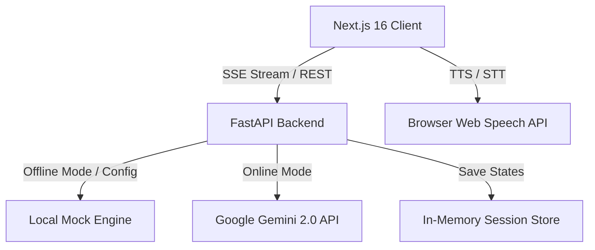

# 🌐 FounderOS — Interactive Multi-Agent Advisory Boardroom

FounderOS is a premium, multi-agent AI system designed to simulate an executive boardroom. Instead of spending months and thousands of dollars consulting human experts, founders can pitch their concepts to 10 specialized virtual advisors who debate the idea, identify risks, and evaluate startup viability inside an interactive 3D virtual boardroom.

Built for the **Google AI Hackathon 2026**.

---

## ✨ Key Features

*   **🌐 Interactive 3D Holographic Boardroom**: A mouse-interactive visual boardroom map built on HTML5 Canvas representing the advisors, active states (Waiting, Thinking, Speaking, Reviewing), and dynamic laser links showing consensus routing.
*   **🗣️ Zero-Dependency Voice Engine (TTS/STT)**: Uses browser-native Web Speech APIs to speak critiques in distinct advisor vocal rates and pitches, and allows the founder to speak their pitch answers directly using microphone dictation.
*   **🧠 Coordinated Multi-Agent Debate**: real-time step-by-step streaming (via FastAPI SSE) where 10 specialized board members critique the concept, cross-examine each other's points, and cast structured votes (Approve, Conditionally Approve, Reject).
*   **🎛️ Interactive Sandbox Tab**: A dashboard panel allowing the founder to override advisor weighting coefficients, apply compliance/security penalties, and trigger instant health score recalculations.
*   **🛡️ Robust Offline Fallback Mode**: Designed with automatic catch-block interceptors that gracefully bypass Google API rate limits (429/404 errors) and use local high-fidelity mock generators to ensure a 100% uptime demo.

---

## 🛠️ Architecture & Tech Stack



*   **Frontend**: Next.js 16 (React, TypeScript, TailwindCSS, HTML5 Canvas)
*   **Backend**: Python 3.14 (FastAPI, Uvicorn, Pydantic v2)
*   **AI Integration**: Google GenAI SDK (`gemini-2.0-flash-lite` and `gemini-pro-latest`)
*   **Database**: In-Memory Repository

---

## 🚀 Quick Start Guide

### 1. Backend Setup

1.  Navigate to the backend directory:
    ```bash
    cd backend
    ```
2.  Activate the virtual environment:
    ```bash
    .\.venv\Scripts\Activate.ps1
    ```
3.  Install dependencies:
    ```bash
    pip install -r requirements.txt
    ```
4.  Configure your environment in `.env`:
    ```env
    GEMINI_API_KEY=your_key_here
    GEMINI_MODEL=gemini-2.0-flash-lite
    OFFLINE_DEMO=true
    ```
5.  Start the FastAPI server:
    ```bash
    uvicorn app.main:app --reload --port 8000
    ```

### 2. Frontend Setup

1.  Navigate to the frontend directory:
    ```bash
    cd frontend
    ```
2.  Install packages:
    ```bash
    npm install
    ```
3.  Start the Next.js development server:
    ```bash
    npm run dev
    ```
4.  Open [http://localhost:3000](http://localhost:3000) in your browser.

---

## 📂 Project Structure

*   [`backend/app/main.py`](file:///c:/Users/bhano/OneDrive/Desktop/FounderOS/backend/app/main.py): Primary REST & SSE API endpoints.
*   [`backend/app/core/board.py`](file:///c:/Users/bhano/OneDrive/Desktop/FounderOS/backend/app/core/board.py): Orchestrates the multi-agent debate and consensus engine.
*   [`backend/app/core/agent.py`](file:///c:/Users/bhano/OneDrive/Desktop/FounderOS/backend/app/core/agent.py): Holds individual agent personas, LLM call structures, and offline fallback mock loops.
*   [`frontend/src/app/page.tsx`](file:///c:/Users/bhano/OneDrive/Desktop/FounderOS/frontend/src/app/page.tsx): The primary command center landing interface.
*   [`frontend/src/lib/speech.ts`](file:///c:/Users/bhano/OneDrive/Desktop/FounderOS/frontend/src/lib/speech.ts): Helper client code managing SpeechSynthesis (TTS) and webkitSpeechRecognition (STT).
